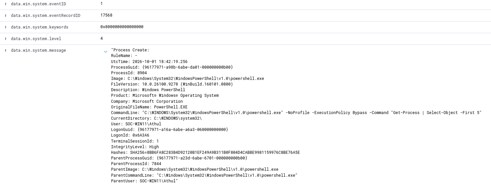

# SOC-001: Suspicious PowerShell Execution Investigation

## Overview

This investigation analyzes a PowerShell process observed on a Windows 11 endpoint monitored by Wazuh and Sysmon.

The process was executed with the `-ExecutionPolicy Bypass` parameter, which can warrant investigation because it may be used in both legitimate administrative activity and malicious PowerShell execution.

The objective was to examine the available endpoint telemetry, analyze the command line and process relationship, and determine whether the observed activity represented malicious behavior.

---

## Lab Environment

| Component | Details |
|---|---|
| SIEM | Wazuh |
| Endpoint | Windows 11 |
| Endpoint Name | SOC-WIN11 |
| Telemetry | Sysmon |
| Event Type | Process Creation |
| Sysmon Event ID | 1 |
| Virtualization | KVM/QEMU |

---

## Detection

Sysmon recorded the creation of a PowerShell process containing the following command:

```powershell
powershell.exe -NoProfile -ExecutionPolicy Bypass -Command "Get-Process | Select-Object -First 5"
```

The presence of:

```text
-ExecutionPolicy Bypass
```

was considered noteworthy and prompted further investigation.

Execution policy bypass alone does not establish malicious activity, so additional context from the process creation event was reviewed.

---

## Evidence

### Sysmon Process Creation Event



The Sysmon Event ID 1 contained information about the process, command line, user, parent process, hash, and process identifiers.

### Process Details

| Field | Value |
|---|---|
| Host | `SOC-WIN11` |
| User | `SOC-WIN11\Athul` |
| Image | `C:\Windows\System32\WindowsPowerShell\v1.0\powershell.exe` |
| Process ID | `8904` |
| Process GUID | `{96177971-a98b-6abe-da01-000000000b00}` |
| Parent Process | `powershell.exe` |
| Parent Process ID | `7844` |
| Integrity Level | `High` |
| Timestamp | `2026-10-01 18:42:19.256 UTC` |

### SHA256

```text
8BB6FA8C283B4D92120B1EF249A9B311B0F804D4CABBE9981159976C8BE76A5E
```

---

## Process Tree Analysis

The Sysmon telemetry showed that the observed PowerShell process was launched by another PowerShell process.

```text
powershell.exe
PID: 7844
    |
    └── powershell.exe
        PID: 8904
        |
        └── Get-Process | Select-Object -First 5
```

Parent process information:

```text
ParentImage:
C:\Windows\System32\WindowsPowerShell\v1.0\powershell.exe

ParentProcessId:
7844

ParentProcessGuid:
{96177971-a23d-6abe-6701-000000000b00}
```

An attempt was made to locate the original process creation event for PID `7844` to continue tracing the process ancestry. That event was not available in the telemetry reviewed, so the earlier process ancestry could not be established.

---

## Investigation

### 1. Command-Line Analysis

The following command was executed:

```powershell
Get-Process | Select-Object -First 5
```

`Get-Process` retrieves information about running processes on the local Windows system.

`Select-Object -First 5` limits the output to the first five results.

The command itself therefore performed local process enumeration.

### 2. Execution Policy

PowerShell was launched with:

```text
-ExecutionPolicy Bypass
```

This parameter allows the PowerShell process to run without applying the configured execution policy for that session.

Because this option can appear in both legitimate and malicious PowerShell activity, it was treated as an investigation indicator rather than evidence of compromise by itself.

### 3. Parent Process Analysis

The parent of PID `8904` was another instance of:

```text
powershell.exe
```

with PID:

```text
7844
```

This established the following relationship:

```text
PowerShell
    ↓
PowerShell with ExecutionPolicy Bypass
    ↓
Local process enumeration
```

The available evidence did not establish malicious behavior from this process chain.

---

## Analysis

The initial point of interest was the use of `-ExecutionPolicy Bypass`.

Further examination showed that the PowerShell command only enumerated running processes using `Get-Process`.

The parent process was another PowerShell instance, which was consistent with the controlled activity generated during the lab exercise.

The available telemetry did not provide sufficient evidence to classify the activity as malicious.

---

## Conclusion

**Disposition:** `Benign / Lab-Generated Activity`

The investigation demonstrated that suspicious-looking command-line parameters should not automatically be classified as malicious.

Context such as the executed command, user, parent process, process identifiers, and surrounding telemetry should be considered before determining the disposition of an event.

---

## Skills Practiced

- Wazuh SIEM investigation
- Sysmon telemetry analysis
- Sysmon Event ID 1 analysis
- Windows process analysis
- PowerShell command-line analysis
- Parent/child process correlation
- Process ID and Process GUID analysis
- SHA256 identification
- Alert triage
- Evidence-based event disposition

---

## Key Takeaway

A potentially suspicious indicator is a starting point for investigation, not proof of compromise.

In this case, `-ExecutionPolicy Bypass` warranted investigation, but analysis of the complete command and process context showed that the observed activity was part of controlled lab testing.
