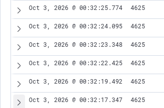
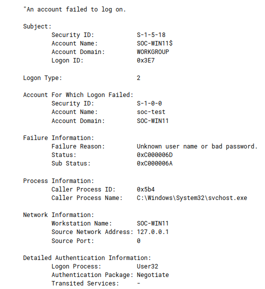

# SOC-002: Repeated Failed Login Investigation

## Overview

This investigation analyzes a series of repeated failed Windows authentication attempts observed on a Windows 11 endpoint monitored by Wazuh.

Multiple failed logon events occurred against the same user account within a short period of time.

The objective was to analyze the authentication events, determine the type and source of the failed logons, and assess whether the activity represented a potential security incident.

---

## Lab Environment

| Component | Details |
|---|---|
| SIEM | Wazuh |
| Endpoint | Windows 11 |
| Endpoint Name | SOC-WIN11 |
| Log Source | Windows Security Event Log |
| Event ID | 4625 |
| Virtualization | KVM/QEMU |

---

## Activity Generated

A dedicated lab account named:

```text
soc-test
```

was created on the Windows endpoint.

Multiple incorrect passwords were then entered at the Windows login screen to generate failed authentication events.

This activity was performed intentionally in the isolated SOC home lab.

---

## Detection

Windows generated multiple:

```text
Event ID 4625 — An account failed to log on
```

Wazuh collected the Windows Security events from the monitored endpoint.

A total of **6 failed authentication events** were observed within approximately **8.4 seconds**.

### Authentication Timeline

| Event | Timestamp |
|---|---|
| 1 | 00:32:17.347 |
| 2 | 00:32:19.492 |
| 3 | 00:32:22.425 |
| 4 | 00:32:23.348 |
| 5 | 00:32:24.095 |
| 6 | 00:32:25.774 |

---

## Evidence

### Repeated Failed Logons



The repeated Event ID 4625 records show multiple authentication failures occurring against the endpoint within a short period.

### Failed Logon Details



One of the failed authentication events was examined in detail.

---

## Event Analysis

The following information was extracted from Windows Event ID 4625:

| Field | Value |
|---|---|
| Target Account | `soc-test` |
| Account Domain | `SOC-WIN11` |
| Logon Type | `2` |
| Failure Reason | `Unknown user name or bad password` |
| Status | `0xC000006D` |
| Sub Status | `0xC000006A` |
| Workstation | `SOC-WIN11` |
| Source Address | `127.0.0.1` |
| Source Port | `0` |
| Caller Process | `C:\Windows\System32\svchost.exe` |
| Logon Process | `User32` |
| Authentication Package | `Negotiate` |

---

## Investigation

### 1. Repeated Authentication Failures

Six failed authentication attempts were identified within approximately 8.4 seconds.

A single failed authentication could result from a user entering an incorrect password.

Multiple failures against the same account within a short period, however, provide a pattern that warrants additional investigation.

### 2. Failure Reason

The event contained:

```text
Status:     0xC000006D
Sub Status: 0xC000006A
```

The event indicated that authentication failed because an incorrect password was supplied for the account.

This was consistent with the activity intentionally generated during the lab.

### 3. Logon Type

The event recorded:

```text
Logon Type: 2
```

Logon Type 2 represents an interactive logon.

This indicated that the authentication attempts were associated with an interactive Windows logon rather than establishing evidence of a remote network authentication attempt.

### 4. Source Analysis

The source network address was:

```text
127.0.0.1
```

This is the IPv4 loopback address and refers to the local system.

The workstation was also identified as:

```text
SOC-WIN11
```

Combined with Logon Type 2 and the `User32` logon process, the available telemetry was consistent with authentication attempts originating locally from the Windows endpoint.

### 5. Successful Authentication

No successful authentication to the `soc-test` account was intentionally performed after the failed attempts during this test.

Therefore, the investigation did not identify a successful authentication associated with the generated test sequence.

---

## Analysis

The frequency of authentication failures was initially noteworthy because multiple failed logons against the same account occurred within only a few seconds.

Further analysis showed:

- The failures targeted the same local account.
- The supplied password was incorrect.
- The logon type was interactive.
- The source address was the local loopback address.
- The workstation was the monitored endpoint itself.
- The activity was generated intentionally as part of the SOC lab.

The evidence therefore did not establish a remote password attack.

---

## Conclusion

**Disposition:** `Benign / Lab-Generated Authentication Testing`

Although repeated authentication failures can indicate password attacks, the context of the events must be analyzed before reaching that conclusion.

In this investigation, Windows authentication telemetry showed that the failed attempts were local interactive logons generated as part of controlled testing.

---

## Skills Practiced

- Wazuh SIEM investigation
- Windows Security Event Log analysis
- Windows Event ID 4625 analysis
- Authentication failure investigation
- Logon Type analysis
- Windows status and substatus interpretation
- Source address analysis
- Event correlation
- Timeline analysis
- Evidence-based alert disposition

---

## Key Takeaway

Multiple authentication failures are an investigation signal, not automatic proof of a brute-force attack.

Analyzing the target account, logon type, source address, failure codes, workstation, authentication mechanism, and timing provides the context required to determine what actually occurred.
